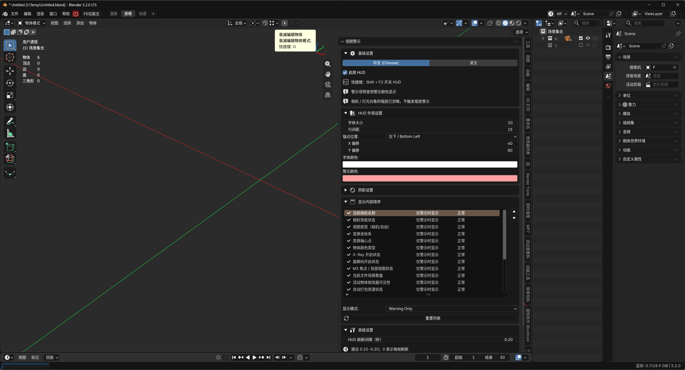

# 视图警示 (View Alerts HUD)


[](https://github.com/wen-yifeng/view_alerts_hud/releases/latest) [](https://github.com/wen-yifeng/view_alerts_hud/releases)

Blender 的很多状态藏在视图各处：物体缩放不是 1、旋转没归零（未应用变换的经典隐患），坐标系或轴心被改、X-Ray 和比例编辑开着忘关、编辑/雕刻镜像还亮着、相机导航被锁定……这些问题往往等到布尔运算出错、镜像不对称、渲染才发现原因。

本插件在 3D 视图上叠加一层轻量 HUD：**`Shift+F2` 开关**，20 项关键状态实时监控。默认**只在出现异常时才浮现对应行**，并以警示色高亮——视图干净时 HUD 完全隐形，不遮挡任何操作。



## 监控项（20 项）

| 分类 | 监控内容 |
| --- | --- |
| 相机与视图 | 相机导航锁定、当前相机名称（相机视图时）、相机/自由视图 |
| 变换 | 变换坐标系、轴心点、比例编辑、物体缩放（≠1 警示，相机/灯光自动忽略）、物体旋转 |
| 视图显示 | 物体颜色类型、X-Ray、面朝向、操纵器隐藏 |
| 模式与对称 | 局部视图（M3 焦点）、编辑模式镜像、雕刻模式镜像、修改器可见性 |
| 场景与动画 | 场景数量、自动打包资源、动画播放中、当前帧非起始帧 |

## 主要特性

- **三种显示模式**：每项可独立设为 始终显示 / 仅警示时显示 / 关闭，默认仅警示
- **排序与折叠**：显示内容在列表中自由排序，N 面板分组可折叠
- **中英双语**：一键切换界面语言
- **外观可调**：字体大小、行间距、屏幕锚点（四角）、偏移、字体/警示颜色、文字阴影
- **性能优化**：状态采集带缓存节流（建议 0.10–0.20 秒，可设为每帧），不影响视口帧率
- **相机视图过滤**：相机视图内只显示与相机相关的项，其余自动隐藏

## 快捷键与入口

- **`Shift+F2`**（3D 视口）：开关 HUD
- **N 面板**：3D 视图 → `N` → 视图警示，全部设置与 HUD 同步

## 安装

**方式一（推荐）：一键安装全部插件并自动更新**

Blender → 编辑 → 偏好设置 → 获取扩展（Get Extensions）→ 右上角 ▼ → 添加远程仓库（Add Remote Repository），粘贴：

```
https://wen-yifeng.github.io/blender-extensions/index.json
```

**方式二：单独安装本插件**

1. 在 [Releases](../../releases) 页面下载 `view_alerts_hud-x.x.x.zip`
2. Blender → 编辑 → 偏好设置 → 获取扩展（Get Extensions）
3. 点击右上角下拉箭头 → 从磁盘安装（Install from Disk），选择 zip 并启用

> Blender 3.0～4.1（无扩展系统）：下载仓库中的 `__init__.py`，改名为 `view_alerts_hud.py`，通过偏好设置 → 插件 → 安装（旧式插件）安装。

## 兼容性

- 代码支持 Blender 3.0 及以上
- 扩展方式安装需 Blender 4.2+

## 许可证

[GPL-3.0-or-later](LICENSE)
